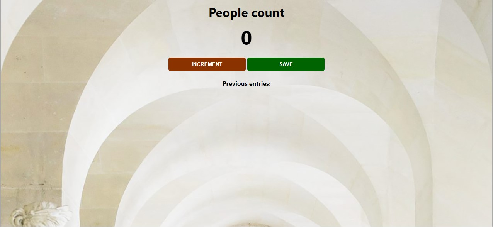

# JavascriptDOM_Museum_visitors_counter_app

Buidling a small project to refresh my knowledge in Javascript.

Although this code is my personal version, I would like to disclosed that I was inspired by a freecodecamp course on youtube that was thought by https://www.scrimba.com/. 

Thank you!

Pseudo  Code for this mini project:
  initialize the count as 0
  listen for clicks on the increment button
  increment the count variable when the button is clicked
  change the count-el in the HTML to reflect the new count
  save previous entries
  
  
  [PROJECT LINK](https://essi5764.github.io/JavascriptDOM_Museum_visitors_counter_app/)
  
  
